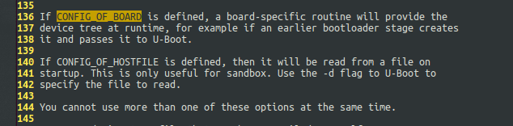

# **格式化SD卡：**

如果SD卡以前安装树莓派系统，这步可以省略。如果在windows下直接格式化FAT32，linux下稍微复杂点参考下面步骤（建议给SD分个区）。

- 使用fdisk新建分区

```
sudo fdisk /dev/sdb
选择 p 打印分区表，并确保选择了正确的磁盘。
选择 d 删除所有现有分区。
选择 n 添加一个新分区。选择主分区和任何其他默认设置。
选择 t 更改分区的系统ID，然后输入b  （W95 FAT32）。
选择 w 保存退出 。
```

- 现在格式化SD卡：

```
sudo mkfs.vfat /dev/sdb1
```

- 挂载分区

```
sudo mount /dev/sdb1 /mnt
```

- 接下来准备准备SD卡内的文件就可以了。

# **SD卡内的启动文件：**

**start4.elf**

third-stage BootLoader文件

树莓派4之后，start.elf改为了start4.elf

下载：sudo wget https://raw.githubusercontent.com/raspberrypi/firmware/master/boot/start4.elf

**config.txt**

```
#可以用官方的模板，或者自己编写，内容如下
kernel=u-boot.bin                  #指定内核，如果不指定start.elf（或start4.elf）默认启动kernel8.img
kernel_address=Ox00080000          #内核地址
arm_64bit=1							#开启64位模式
enable_uart=1                      #开启串口
uart_2ndstage=1
enable_gic=1
```

**fixup4 .dat**

链接器文件，并且与start*.elf上一节中列出的文件配对

**u-boot.bin**

u-boot的树莓派4内核，参考U-boot源码构建

**bcm2711-rpi-4-b.dtb**

树莓派设备树下载地址： 

sudo wget https://raw.githubusercontent.com/raspberrypi/firmware/master/boot/bcm2711-rpi-4-b.dtb

# **U-boot源码构建：**

我是在Ubuntu 18.04下运行

1.先下载u-boot源码，等待的时间可以重开一个命令终端，执行下面的代码

git clone https://github.com/u-boot/u-boot

2.安装64位arm的交叉编译工具链(aarch64-linux-gnu-)，以及依赖项bison、flex

```
sudo apt install gcc-aarch64-linux-gnu
sudo apt-get install bison
sudo apt-get install flex
```

3.指定make的编译工具，使用刚才下载的交叉工具链

```
cd u-boot 
export CROSS_COMPILE=aarch64-linux-gnu- #export 设置环境变量 -p查看所有环境变量
或者
make ARCH=arm CROSS_COMPILE=aarch64-linux-gnu- -j12
编译比较简单
```

4.编译比较简单

```
make distclean #make前要先clean
make rpi_4_defconfig #使用树莓派4的配置文件，更多u-boot支持的芯片，可以进入u-boot/configs文件夹，执行ls -d rpi* 查看
[不确定是否必须]执行完这步会生成.config文件，打开这个文件找到CONFIG_DEFAULT_DEVICE_TREE=""改为CONFIG_DEFAULT_DEVICE_TREE="bcm2711-rpi-4-b"
make -j12 #12这个数字设置CPU核心数的2倍即可，我是6核所有12
```

5.最后复制u-boot.bin到SD卡

rpi_2_config的编译

```
sudo apt-get install gcc-arm-linux-gnueabi   //这是32位交叉编译
export ARCH=arm
export CROSS_COMPILE=arm-linux-gnueabi-

sudo apt-get install gcc-arm-linux-gnueabihf //这也是32位交叉编译，支持浮点，但是树莓派u-boot是用上边这个编译的
//编译最新的u-boot那个仓，报错：*** Your GCC is older than 6.0 and is not supported
export ARCH=arm
export CROSS_COMPILE=arm-linux-gnueabihf-

make distclean
make rpi_2_defconfig
//make rpi_4_32b_defconfig
make -j12

wget https://ftp.denx.de/pub/u-boot/u-boot-2015.04.tar.bz2
解压这个包
cd u-boot-2015.04/
wget https://ftp.denx.de/pub/u-boot/u-boot-2016.09.tar.bz2
```

**关于.config修改说明**

CONFIG_OF_CONTROL=y   开启设备树

CONFIG_DEFAULT_DEVICE_TREE=" "并没有指定dts文件 

CONFIG_OF_BOARD=y       不知道什么意思，看看帮助文档吧

doc/README.fdt-control 里描述如下：



就是开启了设备树，需要指定设备树文件bcm2711-rpi-4-b.dtb