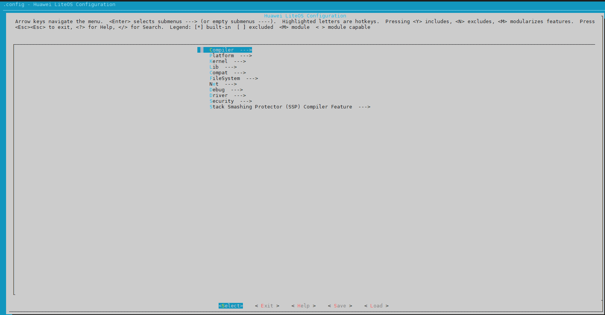
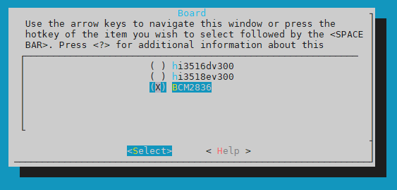

# 1、修改menuconfig和Kconfig

要在鸿蒙的源码中添加树莓派的开发板，得先分析鸿蒙的编译构建系统。menuconfig通过Kconfig配置文件，可以生成.config(kernel\liteos_a\.config)文件，内核的编译配置包含在这个文件中。

## 1.1、添加单板

进入源码/kernel/liteos_a/目录下执行

```
make menuconfig
```

会进入下图的界面，这个界面基于\kernel\liteos_a\Kconfig这个文件生成，而且这个文件还可以包含其它目录下的Kconfig。



```
包含其他目录下的Kconfig，比如：
source "../../kernel/liteos_a/platform/Kconfig"  #这个文件就是添加新开发板的Kconfig
source "../../kernel/liteos_a/arch/Kconfig"
...
```

## 1.2、修改kernel\liteos_a\platform\Kconfig

打开"../../kernel/liteos_a/platform/Kconfig"，仿照其他单板，添加树莓派配置项。

config PLATFORM 下添加：

```
default "Raspberry_Pi_2B" if PLATFORM_RASPBERRYPI2B
```

choice 下添加：

```
config PLATFORM_RASPBERRYPI2B
    bool "Raspberry_Pi_2B"
    select ARCH_CORTEX_A7
```



------

## 1.3、修改kernel\liteos_a\Kconfig

设置单板的默认编译器，config COMPILER_CLANG_LLVM 下添加

```
|| PLATFORM_RASPBERRYPI2B
```

# 2、修改make和Makefile文件

Makefile
platform/Makefile
platform/bsp.mk

## 2.1、修改kernel\liteos_a\Makefile

设置根文件系统类型和大小，在69行左右。

```
ifeq ($(LOSCFG_PLATFORM_RASPBERRYPI2B), y)
FSTYPE = vfat
ROOTFS_SIZE = 0xA00000
endif
```

make lib下添加单板文件夹，在119行左右。同时在源码目录/vendor/下添加对应文件夹，鸿蒙的部分代码未开源，这里要感谢韦东山老师提供的补丁文件。

```
else ifeq ($(LOSCFG_PLATFORM_RASPBERRYPI2B),y)
BOARD_INCLUDE_DIR := $(LITEOSTOPDIR)/../../vendor/broadcom/BCM2836/board
else
```

#### kernel\liteos_a\platform\Makefile：43

仿照其他单板添加

```
$(LOSCFG_PLATFORM_RASPBERRYPI2B)
```

#### kernel\liteos_a\platform\bsp.mk：66

```
else ifeq ($(LOSCFG_PLATFORM_RASPBERRYPI2B),y)
    PLATFORM_INCLUDE += -I $(LITEOSTOPDIR)/../../vendor/broadcom/BCM2836/board/include

########################## LOSCFG_PLATFORM_RASPBERRYPI2B Options##############################
else ifeq ($(LOSCFG_PLATFORM_RASPBERRYPI2B), y)
    HWI_TYPE     := arm/interrupt/gic
    TIMER_TYPE   := arm/timer/arm_generic
    HRTIMER_TYPE := BCM2836/hrtimer
    #UART_TYPE    := amba_pl011
endif
```

#### drivers\hdf\lite\hdf_lite.mk

```
ifeq ($(LOSCFG_PLATFORM_RASPBERRYPI2B), y)
include $(LITEOSTOPDIR)/../../vendor/broadcom/hdf/hdf_vendor.mk
endif
```


### 新建单板文件夹：

在vendor目录下新建broadcom

vendor\broadcom\BCM2836\BCM2836.mk

```
BCM2836_BASE_DIR  := $(LITEOSTOPDIR)/../../vendor/broadcom/BCM2836
```


### 编译测试：

编译测试的时候可以将kernel\liteos_a\tools\build\mk\los_config.mk

```
HIDE :=   #删除@表示显示编译命令  
```

### 编译不通过，修改源码：

修改下面这4个头文件

shell/full/src/base/show.c

shell/full/src/base/shcmd.c

shell/full/src/base/shmsg.c

shell/full/src/cmds/dmesg.c

```
#elif defined LOSCFG_PLATFORM_RASPBERRYPI2B
#include "uart.h"
```

tools\build\mk\los_config.mk：170

```
ifeq ($(LITEOS_PLATFORM),BCM2836)
include $(LITEOSTOPDIR)/../../vendor/broadcom/BCM2836/BCM2836.mk
endif
```


### 文件结构：

内核			/架构			/芯片公司		/芯片			/板卡公司/硬件版本

Cortex-A7	/Armv7-A	/broadcom	/BCM2836 /Raspberry_Pi


Z:\bright\harmony-100ask\kernel\liteos_a\platform\hw\arm\interrupt\gic\gic_v2.c

```
VOID HalIrqUnmask(UINT32 vector)
{
    if ((vector > OS_USER_HWI_MAX) || (vector < OS_USER_HWI_MIN)) {
        return;
    }
    //GIC_REG_32(GICD_ISENABLER(vector >> 5)) = 1U << (vector % 32);  //替换
	*(volatile UINT32 *)((UINTPTR)IO_DEVICE_ADDR(0x3F00B218)) = 1; //使能ARM Timer IRQ	

}
```

Z:\bright\harmony-100ask\kernel\liteos_a\platform\hw\arm\timer\arm_generic\arm_generic_timer.c

```
STATIC_INLINE VOID TimerCtlWrite(UINT32 cntpCtl)
{
    //WRITE_TIMER_REG32(TIMER_REG_CTL, cntpCtl);//替换
    if(cntpCtl == 0){
		*(volatile UINT32 *)((UINTPTR)IO_DEVICE_ADDR(0x3F00B408)) = 0x003E0000;
    	}
	else
	{
		*(volatile UINT32 *)((UINTPTR)IO_DEVICE_ADDR(0x3F00B408)) = 0x003E00A2;
	}
}
```

