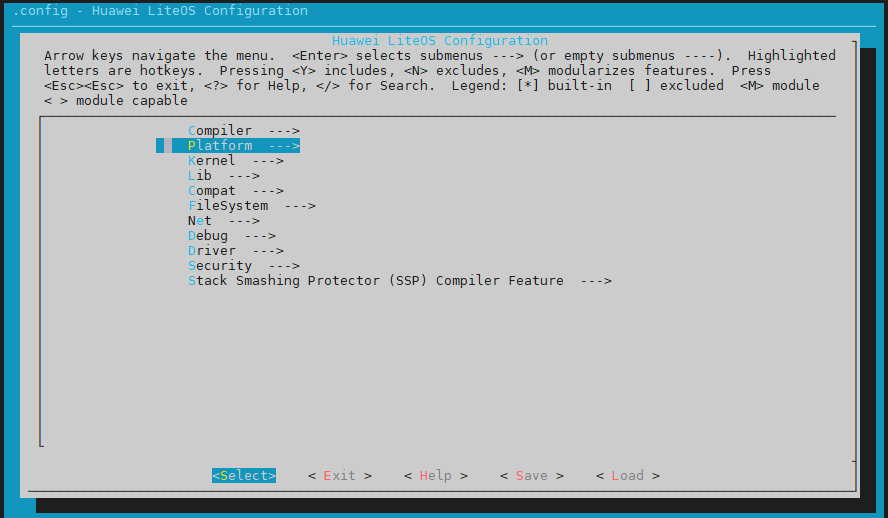
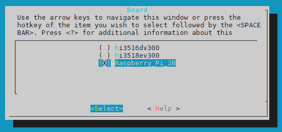
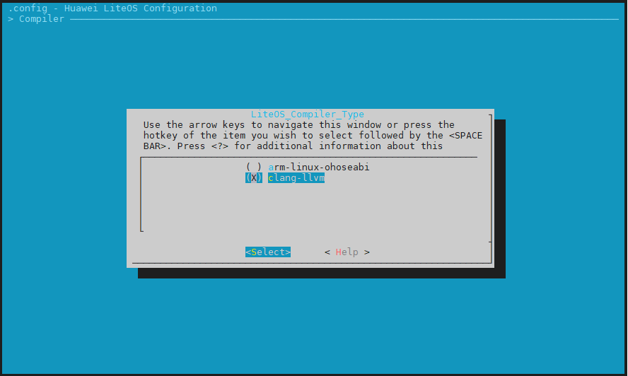

开始前先执行 python build.py ipcamera_hi3516dv300

# 1、修改menuconfig和Kconfig

要在鸿蒙的源码中添加树莓派的开发板，得先分析鸿蒙的编译构建系统。menuconfig通过Kconfig配置文件，可以生成.config(kernel\liteos_a\.config)文件，内核的编译配置项包含在这个文件中。

## 1.1、添加单板

进入源码/kernel/liteos_a/目录下执行

```
make menuconfig
```

会进入下图的界面，这个界面基于\kernel\liteos_a\Kconfig这个文件生成，而且这个文件还可以包含其它目录下的Kconfig。



```
包含其他目录下的Kconfig，比如：
source "../../kernel/liteos_a/platform/Kconfig"  #这个文件就是添加新开发板的Kconfig
source "../../kernel/liteos_a/arch/Kconfig"
...
```

## 1.2、修改kernel\liteos_a\platform\Kconfig

打开"../../kernel/liteos_a/platform/Kconfig"，仿照其他单板，添加树莓派配置项。

config PLATFORM 下添加：

```c
default "Raspberry_Pi_2B" if PLATFORM_RASPBERRYPI2B
```

choice 下添加：

```c
config PLATFORM_RASPBERRYPI2B
    bool "Raspberry_Pi_2B"
    select ARCH_CORTEX_A7
```

添加完这两项，重新运行make menuconfig选择platform就会多出一个新的单板选项。



## 1.3、修改kernel\liteos_a\Kconfig

设置单板的默认编译器，在45、49行左右。

```
config COMPILER_HIMIX_32
    bool "arm-linux-ohoseabi"
    depends on PLATFORM_HI3518EV300 || PLATFORM_HI3516DV300 || PLATFORM_RASPBERRYPI2B

config COMPILER_CLANG_LLVM
    bool "clang-llvm"
        depends on PLATFORM_HI3518EV300 || PLATFORM_HI3516DV300 || PLATFORM_RASPBERRYPI2B
```

添加了这两项Compiler下才会出现编译器的选择，如下图：



选择这个新单板保存退出后，查看\kernel\liteos_a\.config，会发现多出下面两项。

```
#
# Platform
#
LOSCFG_PLATFORM="Raspberry_Pi_2B"
# LOSCFG_PLATFORM_HI3516DV300 is not set
# LOSCFG_PLATFORM_HI3518EV300 is not set
LOSCFG_PLATFORM_RASPBERRYPI2B=y
```

# 2、修改make和Makefile文件

Makefile
platform/Makefile
platform/bsp.mk

## 2.1、修改kernel\liteos_a\Makefile

设置根文件系统类型和大小，在62行左右。

```
ifeq ($(LOSCFG_PLATFORM_RASPBERRYPI2B), y)
FSTYPE = jffs2
ROOTFS_SIZE = 0xA00000
endif
```

make lib下添加单板文件夹，在107行左右。同时在源码目录/vendor/下添加对应文件夹，鸿蒙的部分代码未开源，这里要感谢韦东山老师提供的补丁文件。

```
##### make lib #####
$(__LIBS): $(OUT) $(CXX_INCLUDE)

ifeq ($(LOSCFG_PLATFORM_RASPBERRYPI2B),y)
BOARD_INCLUDE_DIR := $(LITEOSTOPDIR)/../../vendor/broadcom/BCM2836/board
else
BOARD_INCLUDE_DIR := $(LITEOSTOPDIR)/../../vendor/hisi/hi35xx/$(LITEOS_PLATFORM)/config/board
endif

$(OUT): $(LITEOS_MENUCONFIG_H)
	$(HIDE)mkdir -p $(OUT)/lib
	$(HIDE)$(CC) -I$(LITEOS_PLATFORM_BASE)/include -I$(BOARD_INCLUDE_DIR) \
		-E $(LITEOS_PLATFORM_BASE)/board.ld.S \
		-o $(LITEOS_PLATFORM_BASE)/board.ld -P
```

## 2.2、增加单板文件夹

新建单板文件夹，将韦东山的老师补丁中vendor文件夹复制过来，在vendor目录下新建broadcom

单板文件目录结构可以按照下面的格式修改：

内核/架构/芯片公司/芯片/板卡公司/硬件版本

Cortex-A7/Armv7-A/broadcom/BCM2836/Raspberry_Pi/..

## 2.3、然后修改vendor\broadcom\BCM2836\BCM2836.mk

设置基目录地址

```
BCM2836_BASE_DIR  := $(LITEOSTOPDIR)/../../vendor/broadcom/BCM2836
```

## 2.4、kernel\liteos_a\platform\Makefile

仿照其他单板添加，47行左右

```
$(LOSCFG_PLATFORM_RASPBERRYPI2B) \
```

## 2.5、kernel\liteos_a\platform\bsp.mk

设置单板的设备类型，比如中断、timer、串口、USB之类的，58行左右

```
########################## LOSCFG_PLATFORM_RASPBERRYPI2B Options##############################
else ifeq ($(LOSCFG_PLATFORM_RASPBERRYPI2B), y)
    HWI_TYPE     := arm/interrupt/gic
    TIMER_TYPE   := arm/timer/arm_generic
    HRTIMER_TYPE := BCM2836/hrtimer
    #UART_TYPE    := amba_pl011
```

设置头文件要包含的目录，在90行左右

```
ifeq ($(findstring y, $(LOSCFG_PLATFORM_HI3518EV300)$(LOSCFG_PLATFORM_HI3516DV300)), y)
    PLATFORM_INCLUDE += -I $(LITEOSTOPDIR)/../../vendor/hisi/hi35xx/$(LITEOS_PLATFORM)/config/board/include/hisoc
else ifeq ($(LOSCFG_PLATFORM_RASPBERRYPI2B),y)
    PLATFORM_INCLUDE += -I $(LITEOSTOPDIR)/../../vendor/broadcom/BCM2836/board/include
endif
```

## 2.6、drivers\hdf\lite\hdf_lite.mk

设置HDF的顶层目录，在39行左右，有点没搞懂，为啥不直接使用一个默认的路径

```
include $(LITEOSTOPDIR)/../../vendor/huawei/hdf/hdf_vendor.mk
替换为：
ifeq ($(findstring y, $(LOSCFG_PLATFORM_HI3518EV300)$(LOSCFG_PLATFORM_HI3516DV300)), y)
include $(LITEOSTOPDIR)/../../vendor/huawei/hdf/hdf_vendor.mk
endif

ifeq ($(LOSCFG_PLATFORM_RASPBERRYPI2B), y)
include $(LITEOSTOPDIR)/../../vendor/broadcom/hdf/hdf_vendor.mk
endif
```

## 2.7、vendor\huawei\hdf\hdf_vendor.mk（TODO)

设置下单板的HDF相关文件路径，18行左右

```
else ifeq ($(LOSCFG_PLATFORM_RASPBERRYPI2B), y)
    LIB_SUBDIRS += $(LITEOS_SOURCE_ROOT)/vendor/broadcom/BCM2836/config
    VENDOR_HDF_DRIVERS_PLATFORM_ROOT := $(LITEOSTOPDIR)/../../vendor/broadcom/BCM2836/platform #这个文件夹还没有
```

# 3、编译：

编译测试的时候可以修改kernel\liteos_a\tools\build\mk\los_config.mk	HIDE的值为空，可以显示make的执行命令

```
HIDE :=   #删除@表示显示make的执行命令
```

## 3.1、修改下面这4个头文件

kernel/liteos_a/shell/full/src/base/show.c

kernel/liteos_a/shell/full/src/base/shcmd.c

kernel/liteos_a/shell/full/src/base/shmsg.c

kernel/liteos_a/shell/full/src/cmds/dmesg.c

```
#elif defined LOSCFG_PLATFORM_RASPBERRYPI2B
#include "uart.h"
```

## 3.2、tools\build\mk\los_config.mk：170

```
ifeq ($(LITEOS_PLATFORM),BCM2836)
include $(LITEOSTOPDIR)/../../vendor/broadcom/BCM2836/BCM2836.mk
endif
```

kernel\liteos_a\kernel\common\los_config.h

43行左右，注释此行

```
//#include "hisoc/clock.h"
```


Z:\bright\harmony-100ask\kernel\liteos_a\platform\hw\arm\interrupt\gic\gic_v2.c

```
VOID HalIrqUnmask(UINT32 vector)
{
    if ((vector > OS_USER_HWI_MAX) || (vector < OS_USER_HWI_MIN)) {
        return;
    }
    //GIC_REG_32(GICD_ISENABLER(vector >> 5)) = 1U << (vector % 32);  //替换
	*(volatile UINT32 *)((UINTPTR)IO_DEVICE_ADDR(0x3F00B218)) = 1; //使能ARM Timer IRQ	

}
```

Z:\bright\harmony-100ask\kernel\liteos_a\platform\hw\arm\timer\arm_generic\arm_generic_timer.c

```
STATIC_INLINE VOID TimerCtlWrite(UINT32 cntpCtl)
{
    //WRITE_TIMER_REG32(TIMER_REG_CTL, cntpCtl);//替换
    if(cntpCtl == 0){
		*(volatile UINT32 *)((UINTPTR)IO_DEVICE_ADDR(0x3F00B408)) = 0x003E0000;
    	}
	else
	{
		*(volatile UINT32 *)((UINTPTR)IO_DEVICE_ADDR(0x3F00B408)) = 0x003E00A2;
	}
}
```

