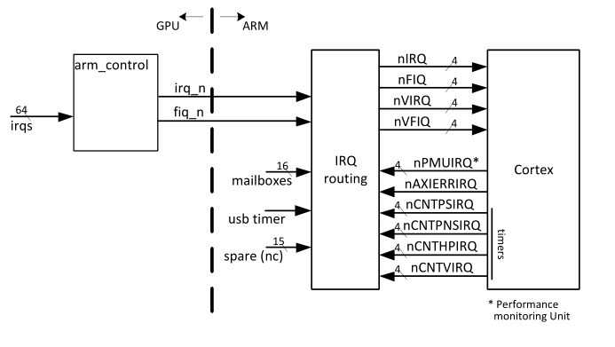

# 1 Introduction 介绍

The document describes the implementation of the Quad-A7 core on top of the 2708 project resulting in a new (BCM2836) product.

该文档描述了在2708项目之上的Quad-A7核心的实现，从而产生了一个新的(BCM2836)产品。

# 2 System overview 系统概述

The ARM address map is split according to the following table: ARM地址映射按照下表进行分割:

| Address                    | Device(s)                  |                       |
| -------------------------- | -------------------------- | --------------------- |
| 0x0000_0000 .. 0x3FFF_FFFF | GPU access                 | GPU访问               |
| 0x3E00_0000 .. 0x3FFF_FFFF | GPU peripheral access1     | GPU 外设访问          |
| 0x4000_0000 .. 0xFFFF_FFFF | Local peripherals          | 本地的外围设备        |
| 0x4000_0000 .. 0x4001_FFFF | ARM timer, IRQs, mailboxes | ARM定时器，IRQs，邮箱 |
| 0x4002_0000 .. 0x4002_FFFF | Debug ROM                  |                       |
| 0x4003_0000 .. 0x4003_FFFF | DAP                        |                       |
| 0x4004_0000 .. 0xFFFF_FFFF | Unused                     |                       |

# 3 ARM control

The ARM control logic is a module which performs the following functions: ARM控制逻辑是一个模块，它执行以下功能:

| Provide a 64-bit Timer                    | 提供64位计时器       |
| ----------------------------------------- | -------------------- |
| Route the various interrupts to the cores | 将各种中断路由到核心 |
| Route the GPU interrupts to the core      | 路由GPU中断到核心    |
| Provide mailboxes between the processors  | 在处理器之间提供邮箱 |
| Provide extra interrupt timer             | 提供额外的中断计时器 |

## 3.1 64-bit Timer

The A7-core requires a 64-bit timing input signal which is used to implement the four timers internally to each processor core. There is only one 64-bit timer signal going to all four cores. This means that any changes to the timer will affect all cores.

A7-core需要一个64位定时输入信号，它被用来在每个处理器核心内部实现四个定时器。只有一个64位定时器信号去所有四个核。这意味着对计时器的任何更改都将影响所有核。

### 3.1.1 Timer clock

I have not found any information on how fast this timer should run. It seems common to run it of the processor clock. However that would not give a reliably timing signal when the frequency of the processor is variable. Therefore the source of the timer can come from either the external crystal or from a CPU related clock.

我没有发现关于这个计时器应该运行多快的任何信息。在处理器时钟上运行它似乎很常见。然而，当处理器的频率可变时，它不会给出可靠的定时信号。因此，定时器的来源可以来自外部晶体或CPU相关的时钟。

To give maximum flexibility to the timer speed there is a 32-bit pre-scaler. This prescaler can provide integer as well as fractional division ratios.

为了给最大的灵活性，定时器速度有一个32位的pre-scaler。这个prescaler可以提供整数以及分数除法比。

divider = 2^31 / (prescaler_value)             (prescaler_value<=2^31)

Thus setting the prescaler to 0x8000_0000 gives a divider ratio of 1. Setting the prescaler to 0 will stop the timer.

因此，将预分频器设置为0x8000_0000将得到一个分频比1。将预分频器设置为0将停止计时器。

To get a divider ratio of 19.2 use: 2^31/19.2 = 0x06AA_AAAB. The value is rounded upwards and introduces an error of 8.9E-9 which is much lower than any ordinary crystal oscillator produces.

要得到19.2的分频比，请使用:2^31/19.2 = 0x06AA_AAAB。该值向上四舍五入，引入8.9E-9的误差，这比任何普通晶体振荡器产生的误差都要低得多。

Do not use timer values >2^31 (2147483648)     不使用定时器值>2^31 (2147483648)

To simplify the design the timer is running from the local peripheral (APB) clock. That clock is half the speed of the ARM thus the timer cannot represent the ARM clock frequency exactly. To give a nearest number you can increment the timer by 2 thus giving a value close to the ARM clock frequency. Beware that if the timer increment is set to 2 you will only get either all even or all odd values (Depending on if the initial value you write to it is even or odd).

为了简化设计，计时器从本地外围设备(APB)时钟运行。该时钟的速度是ARM的一半，因此计时器不能准确地代表ARM时钟的频率。为了给出一个最近的数字，你可以将计时器增加2，从而给出一个接近ARM时钟频率的值。注意，如果计时器增量设置为2，您将只得到所有偶数或所有奇数值(取决于您写入它的初始值是偶数还是奇数)。

### 3.1.2 64-bit timer read/write

The ARM has 32-bit registers and the main timer has a 64-bits wide changing value. There is the potential for reading the wrong value if the timer value changes between reading the LS and MS 32 bits. Therefore it has dedicated logic to give trouble free access to the 64-bit value.

ARM有32位寄存器和主定时器有64位宽的变化值。如果计时器的值在读取LS和MS 32位之间改变，则有可能读取错误的值。因此，它有专门的逻辑来提供对64位值的无障碍访问。

When reading the 64-bit timer value the user must always read the LS 32 bits first. At the same time the LS-32 bits are read, internal a copy is made of the MS-32 bits into a timer-read-hold register. When reading the timer MS-32 bits actually the timer-read-hold register is read.

当读取64位计时器值时，用户必须总是先读取LS 32位。在LS-32位被读的同时，内部的一个拷贝是由MS-32位组成的一个定时器读保持寄存器。当读取定时器MS-32位时，实际上是读取定时器读取保持寄存器。

When writing the 64-bit timer value the user must always write the LS 32 bits first. The LS 32-bits are stored in a timer-write-hold register. When the user writes the MS 32-bit, the stored LS bits are written as well.

当写入64位定时器值时，用户必须总是首先写入LS 32位。LS的32位存储在一个定时器写保持寄存器中。当用户写入32位MS时，存储的LS位也被写入。

The timer pre-scaler register is set to zero when the timer value (MS) is written.当写入计时器值(MS)时，计时器预缩放寄存器被设置为零。

## 3.2 Interrupt routing

There are numerous interrupts which need to be routed. The interrupt routing logic has the following input signals:

有许多中断需要被路由。中断路由逻辑有以下输入信号:

- Core related interrupts			核心相关中断
- Core un-related interrupts		核心无关中断

### 3.2.1 Core related interrupts

Core related interrupts are interrupts which are bound to one specific core. Most of these are interrupts generated by that core itself like the four timer interrupt signals. Additionally each core has four mailboxes assigned to it. These are the core related interrupts:

核心相关中断是绑定到一个特定核心的中断。这些中断大多是由核心本身产生的，就像四个计时器中断信号。此外，每个核心有四个分配给它的邮箱。以下是核心的相关中断:

- Four timer interrupts (64-bit timer)      四个计时器中断(64位计时器)
- One performance monitor interrupts  一个性能监视器中断
- Four Mailbox interrupts                          四个邮箱中断

For each of these interrupts you can only choose to send them to either the IRQ pin or to the FIQ pin of one core. (or not pass at all) The following table shows the truth table:

对于这些中断中的每一个，您只能选择将它们发送到一个核心的IRQ引脚或FIQ引脚。下表显示了真值表:

| FIQ bit | IRQ Bit | Destination     |
| ------- | ------- | --------------- |
| 0       | 0       | None (disabled) |
| 0       | 1       | IRQ             |
| 1       | 0       | FIQ             |
| 1       | 1       | FIQ             |

The mailbox interrupts do not have a separate interrupt enable/disable bit. The routing bits have to be used for that. Unfortunately this enables or disables all 32 bits of a mailbox.

邮箱中断没有单独的中断启用/禁用位。必须使用路由位。不幸的是，这将启用或禁用邮箱的所有32位。

After a reset all bits are zero so none of the interrupts is enabled.  重置后，所有位都为零，因此没有一个中断被启用。

### 3.2.2 Core un-related interrupts

Core unrelated interrupts are interrupts which can be send to any of the four cores and to either the interrupt or the fast-interrupt of that core. These are the core unrelated interrupts:

核心无关中断是可以发送到四个核心中的任何一个，或者发送到该核心的中断或快速中断的中断。以下是核心的不相关中断:

- GPU IRQ (As generated by the ARM Control logic)
- GPU FIQ (As generated by the ARM Control logic)
- Local timer interrupt
- AXI error
- (unused: Fifteen local peripheral interrupts)

For each of these interrupts you can choose to send them to either the IRQ pin or to the FIQ pin of any of the four cores. The following table shows the truth table:

对于这些中断中的每一个，您可以选择将它们发送到任何四个核心的IRQ引脚或FIQ引脚。下表为真值表:

| Routing code | Destination |
| ------------ | ----------- |
| 000          | IRQ Core 0  |
| 001          | IRQ Core 1  |
| 010          | IRQ Core 2  |
| 011          | IRQ Core 3  |
| 100          | FIQ Core 0  |
| 101          | FIQ Core 1  |
| 110          | FIQ Core 2  |
| 111          | FIQ Core 3  |

Note that these interrupts do not have a 'disable' code. They are expected to have an enable/disable bit at the source where they are generated. After a reset all bits are zero thus all interrupts are send to the IRQ of core 0.

注意，这些中断没有“禁用”代码。在生成它们的源上，它们应该有一个启用/禁用位。重置后所有位都为零，因此所有中断都被发送到核心0的IRQ。

## 3.3 Mailboxes

A mailbox is a 32-bit wide write-bits-high-to-set and write-bits-high-to-clear register. The write-set register addresses are write only. The write-clear register addresses can be read as well. A mailbox generates and interrupt as long as it is non-zero.

邮箱是一个32位宽的写位高到设置和写位高到清除寄存器。写集寄存器地址是只写的。写清楚的寄存器地址也可以读。只要邮箱非零，它就会生成并中断。

The system has sixteen mailboxes, four for each core. The system has no doorbells. You can use the mailboxes as doorbells instead.

系统有16个邮箱，每个核心4个邮箱。这个系统没有门铃。你可以把邮箱当作门铃来用。

Mailbox 0-3 are dedicated to core 0, mailbox 4-7 are dedicated to core 1 etc. Each mailbox has two interrupt routing bits as described in 3.2.1 Core related interrupts.

邮箱0-3专用于核心0，邮箱4-7专用于核心1等等。每个邮箱有两个中断路由位，如3.2.1核心相关中断所述。

There is no difference between any of the four mailboxes assigned to a core. It is left to the programmer to decide how to use them.

分配给一个核心的四个邮箱之间没有区别。这是留给程序员来决定如何使用它们。

# 4 Registers

| Address         | Register                                     |
| --------------- | -------------------------------------------- |
| 0x4000_0000     | Control register                             |
| 0x4000_0004     | <unused>                                     |
| 0x4000_0008     | Core timer prescaler                         |
| 0x4000_000C     | GPU interrupts routing                       |
| 0x4000_0010     | Performance Monitor Interrupts routing-set   |
| 0x4000_0014     | Performance Monitor Interrupts routing-clear |
| 0x4000_0018     | <unused>                                     |
| 0x4000_001C     | Core timer access LS 32 bits                 |
| 0x4000_0020     | Core timer access MS 32 bits                 |
| 0x4000_0024     | Local Interrupt 0 [1-7] routing              |
| ~~0x4000_0028~~ | ~~Local Interrupts 8-15 routing~~            |
| 0x4000_002C     | Axi outstanding counters                     |
| 0x4000_0030     | Axi outstanding IRQ                          |
| 0x4000_0034     | Local timer control & status                 |
| 0x4000_0038     | Local timer write flags                      |
| 0x4000_003C     | <unused>                                     |
| 0x4000_0040     | Core0 timers Interrupt control               |
| 0x4000_0044     | Core1 timers Interrupt control               |
| 0x4000_0048     | Core2 timers Interrupt control               |
| 0x4000_004C     | Core3 timers Interrupt control               |
| 0x4000_0050     | Core0 Mailboxes Interrupt control            |
| 0x4000_0054     | Core1 Mailboxes Interrupt control            |
| 0x4000_0058     | Core2 Mailboxes Interrupt control            |
| 0x4000_005C     | Core3 Mailboxes Interrupt control            |
| 0x4000_0060     | Core0 IRQ Source                             |
| 0x4000_0064     | Core1 IRQ Source                             |
| 0x4000_0068     | Core2 IRQ Source                             |
| 0x4000_006C     | Core3 IRQ Source                             |
| 0x4000_0070     | Core0 FIQ Source                             |
| 0x4000_0074     | Core1 FIQ Source                             |
| 0x4000_0078     | Core2 FIQ Source                             |
| 0x4000_007C     | Core3 FIQ Source                             |
| 0x4000_0080     | Core 0 Mailbox 0 write-set (WO)              |
| 0x4000_0084     | Core 0 Mailbox 1 write-set (WO)              |
| 0x4000_0088     | Core 0 Mailbox 2 write-set (WO)              |
| 0x4000_008C     | Core 0 Mailbox 3 write-set (WO)              |
| 0x4000_0090     | Core 1 Mailbox 0 write-set (WO)              |
| 0x4000_0094     | Core 1 Mailbox 1 write-set (WO)              |
| 0x4000_0098     | Core 1 Mailbox 2 write-set (WO)              |
| 0x4000_009C     | Core 1 Mailbox 3 write-set (WO)              |
| 0x4000_00A0     | Core 2 Mailbox 0 write-set (WO)              |
| 0x4000_00A4     | Core 2 Mailbox 1 write-set (WO)              |
| 0x4000_00A8     | Core 2 Mailbox 2 write-set (WO)              |
| 0x4000_00AC     | Core 2 Mailbox 3 write-set (WO)              |
| 0x4000_00B0     | Core 3 Mailbox 0 write-set (WO)              |
| 0x4000_00B4     | Core 3 Mailbox 1 write-set (WO)              |
| 0x4000_00B8     | Core 3 Mailbox 2 write-set (WO)              |
| 0x4000_00BC     | Core 3 Mailbox 3 write-set (WO)              |
| 0x4000_00C0     | Core 0 Mailbox 0 read & write-high-to-clear  |
| 0x4000_00C4     | Core 0 Mailbox 1 read & write-high-to-clear  |
| 0x4000_00C8     | Core 0 Mailbox 2 read & write-high-to-clear  |
| 0x4000_00CC     | Core 0 Mailbox 3 read & write-high-to-clear  |
| 0x4000_00D0     | Core 1 Mailbox 0 read & write-high-to-clear  |
| 0x4000_00D4     | Core 1 Mailbox 1 read & write-high-to-clear  |
| 0x4000_00D8     | Core 1 Mailbox 2 read & write-high-to-clear  |
| 0x4000_00DC     | Core 1 Mailbox 3 read & write-high-to-clear  |
| 0x4000_00E0     | Core 2 Mailbox 0 read & write-high-to-clear  |
| 0x4000_00E4     | Core 2 Mailbox 1 read & write-high-to-clear  |
| 0x4000_00E8     | Core 2 Mailbox 2 read & write-high-to-clear  |
| 0x4000_00EC     | Core 2 Mailbox 3 read & write-high-to-clear  |
| 0x4000_00F0     | Core 3 Mailbox 0 read & write-high-to-clear  |
| 0x4000_00F4     | Core 3 Mailbox 1 read & write-high-to-clear  |
| 0x4000_00F8     | Core 3 Mailbox 2 read & write-high-to-clear  |
| 0x4000_00FC     | Core 3 Mailbox 3 read & write-high-to-clear  |

## 4.1 Write-set / Write-clear registers

To allow atomic operations a number of register are split into a write-set register and a write-clear register.

为了允许原子操作，许多寄存器被分为写集寄存器和写清除寄存器。

A **write-set register** allows you to set additional bits high. Bits which were already high are not affected. You set a bit high by writing the value '1' to it. Everywhere you write a '0' bit the original register contents remains unchanged.

写集寄存器允许您设置额外的高位。已经很高的比特不受影响。您可以通过将值‘1’写入它来设置高一点。无论在哪里写入'0'位，原始寄存器内容都保持不变。

| Old bit value | Write bit value | Result bit value |
| ------------- | --------------- | ---------------- |
| 0             | 0               | 0                |
| 0             | 1               | 1                |
| 1             | 0               | 1                |
| 1             | 1               | 1                |

Thus writing 0xFC060014 to a register containing 0x30840008 gives 0xFC86001C.因此，将0xFC060014写入包含0x30840008的寄存器会得到0xFC86001C。

A write-clear register allows you to set additional bits low. Bits which were already low are not affected. You set a bit low by writing the value '1' to it. Everywhere you write a '0' bit the original register contents remains unchanged. Beware that you write a one to get a zero!

写-清楚寄存器允许你设置额外的低位。已经很低的比特数不受影响。您可以通过将值'1'写入它来设置一个较低的值。无论在哪里写入'0'位，原始寄存器内容都保持不变。当心你写了一个1会得到一个0 !

| Old bit value | Write bit value | Result bit value |
| ------------- | --------------- | ---------------- |
| 0             | 0               | 0                |
| 0             | 1               | 0                |
| 1             | 0               | 1                |
| 1             | 1               | 0                |

Thus writing 0xFC060014 to a register containing 0x30840008 gives 0x00800008.因此，将0xFC060014写入包含0x30840008的寄存器将得到0x00800008。

This system is particular useful when dealing with asynchronous events like interrupts. Interrupt status its can appear at any time. Thus it is possible that the CPU reads the interrupt-pending register and sees it 4 high. The next clock cycle an interrupt comes in and sets additionally bit 2 high but the processor is o aware of this. The processor handles the interrupt bit 4. To clear the interrupt, the processor writes ack the value it has read. (which has bit 4 set) and thus it guarantees that only bit 4 gets cleared and any issed, non -processed, interrupt bits remain pending.

这个系统在处理异步事件(如中断)时特别有用。中断状态可以在任何时候出现。因此，有可能CPU读取中断挂起寄存器时看到它的高度是4。下一个时钟周期中断进入并设置额外的2位高，但处理器不知道这一点。处理器处理中断位4。为了清除中断，处理器将读到的值写入ack。(设置了第4位)，因此它保证只有第4位被清除，任何issed、未处理的中断位仍然挂起。

## 4.2 Control register

The control register is currently only used to control the 64-bit core timer.控制寄存器目前仅用于控制64位核心计时器。

| Address:  0x4000_0000 | Reset: 0x0000_0000                                           |
| --------------------- | ------------------------------------------------------------ |
| Bits                  | Description                                                  |
| 31-10                 | <Reserved>                                                   |
| 9                     | 1 : 表示内核64位定时器增量为2                 0 : 表示内核64位定时器增量为1 1 : 64-bit Core timer increments  by 2     0 : 64-bit Core timer increments by1 |
| 8                     | Core timer clock source 核心定时器时钟源 1 : 64-bit Core timer runs from the APB clock     0 : 64-bit Core timer runs from the Crystal clock 1 : 64位核心定时器从APB时钟运行。                      0 : 64位核心定时器从Crystal时钟运行(晶振时钟) |
| 7-0                   | <Reserved>                                                   |

Bit 8: Core timer clock source  核心定时器时钟源

This bit controls what the source clock is of the 64-bit Core timer . Actually it selects the source clock of the Core timer prescaler but that amounts to the same end-result.

这个位控制64位核心计时器的源时钟是什么。实际上，它选择了核心定时器预分频器的源时钟，但那等于相同的最终结果。

- If set the 64-bit core timer pre-scaler is running of the APB clock.如果设置了64位的核心定时器，pre-scaler正在运行APB时钟。
- If clear the 64-bit core timer pre-scaler is running of the Crystal clock.如果清除64位核心计时器pre-scaler正在运行Crystal时钟。

Note that the APB clock is running at half the speed of the ARM clock. Thus the pre-scaler is only changing every second CPU clock cycle.

注意，APB时钟的运行速度是ARM时钟的一半。因此，pre-scaler只是每秒钟改变CPU时钟周期。

Bit 9: Timer increment

This bit controls the step size of the 64-bit core timer . This may be important if you want the core timer to accurate represent the number of CPU cycles.

这个位控制64位核心计时器的步长。如果您希望核心计时器准确地表示CPU周期的数量，这可能很重要。

The core timer pre-scaler is running of the APB clock. As the APB clock is running at half the speed of the ARM clock, you cannot get a timer value equal to the ARM clock cycles, even if the pre-scaler is set to divide-by-one. This bit provides a means of getting close to the actual number of CPU cycles.

核心定时器pre-scaler正在运行APB时钟。由于APB时钟运行的速度是ARM时钟的一半，您无法得到等于ARM时钟周期的计时器值，即使pre-scaler被设置为除一。这个位提供了接近实际CPU周期数的方法。

- If set the 64-bit core timer is incremented by 2.如果设置，则64位核心计时器将增加2。
- If clear the 64-bit core timer is incremented by 1如果清除，则64位核心计时器将增加1。

This will still not get you the exact number of CPU cycles but will get you close to plus/minus one. Beware that if the core timer increment is set to 2 you will only get either all even or all odd values (Depending on if the initial value you write to it is even or odd).

这仍然不能得到准确的CPU周期数，但可以接近正负一。注意，如果核心计时器增量设置为2，你将只会得到所有偶数或奇数值(取决于你写入它的初始值是偶数还是奇数)。

## 4.3 Core timer register

There is a core timer pre-scaler registers and two timer read/write registers.有一个核心定时器预定标寄存器和两个定时器读/写寄存器。

| ~~Address: 0x4000_0004 <Deprecated>~~ | ~~Reset: 0x0000_0000~~                          |
| ------------------------------------- | ----------------------------------------------- |
| ~~Bits~~                              | ~~Description~~                                 |
| ~~31-0~~                              | ~~Timer prescaler subtract 计时器pre-scaler减~~ |

This register is deprecated 该寄存器已弃用

| Address: 0x4000_008 Core timer pre-scaler. | Reset: 0x0000_0000    |
| ------------------------------------------ | --------------------- |
| Bits                                       | Description           |
| 31-0                                       | Core timer pre-scaler |

timer_frequency = (231/prescaler) * input frequency  (Pre-scaler <= 231)
For details see §3.1.1 Timer clock.

| Address: 0x4000_01C: Core timer read: LS 32 bits.,  Write: LS-32 holding register | Reset: 0x0000_0000                                           |
| ------------------------------------------------------------ | ------------------------------------------------------------ |
| Bits                                                         | Description                                                  |
| 31-0                                                         | 64-bit core timer read/write, LS 32 bits When reading returns the current 32 LS bit of the 64 timer and triggers storing a copy of the MS 32 bits. When writing: stores a copy of the 32 bits written. That copy is transferred to the timer when the MS 32 bits are written. 当读取时，返回64定时器的当前32 LS位，并触发存储MS 32位副本。 写入时:存储已写入的32位文件的副本。当ms32位写入时，该副本被转移到计时器 |

| Address: 0x4000_020: Core timer read: Stored MS 32 bits register,  Write: MS-32 bits | Reset: 0x0000_0000                                           |
| ------------------------------------------------------------ | ------------------------------------------------------------ |
| Bits                                                         | Description                                                  |
| 31-0                                                         | 64-bit core timer read/write, MS 32 bits When reading returns the status of the core timer-read-hold register. That register is loaded when the user does a read of the LS-32 timer bits. There is little sense in reading this register without first doing a read from the LS-32 bit register. When writing the value is written to the timer, as well as the value previously written to the LS-32 write-holding bit register. There is little sense in writing this register without first doing a write to the LS-32 bit register. 64位内核定时器读/写，MS 32位 读时返回内核定时器读保持寄存器的状态。当用户读取LS-32定时器位时，该寄存器被 加载。如果不先从LS-32位寄存器读取 该寄存器，则读取该寄存器是没有意义的。 写入时，该值被写入定时器，以及之前写入LS-32写保持位寄存器 的值。如果 不先写入LS-32位寄存器，那么写入这个寄存器就没有意义。 |

## 4.4 GPU interrupts routing

The GPU interrupt routing register controls where the IRQ and FIQ of the GPU are routed to.GPU中断路由寄存器控制GPU的IRQ和FIQ被路由到的地方。

| Address: 0x4000_000C GPU interrupt routing | Reset: 0x0000_0000                                           |
| ------------------------------------------ | ------------------------------------------------------------ |
| Bits                                       | Description                                                  |
| 31-4                                       | Reserved                                                     |
| 3:2                                        | GPU FIQ routing: 00 : GPU FIQ goes to FIQ input of core 0 01 : GPU FIQ goes to FIQ input of core 1 10 : GPU FIQ goes to FIQ input of core 2 11 : GPU FIQ goes to FIQ input of core 3 |
| 1:0                                        | GPU IRQ routing: 00 : GPU IRQ goes to IRQ input of core 0 01 : GPU IRQ goes to IRQ input of core 1 10 : GPU IRQ goes to IRQ input of core 2 11 : GPU IRQ goes to IRQ input of core 3 |

The IRQ /FIQ can be connected to one processor core only. This also means that there is only one possible GPU-IRQ/GPU-FIQ interrupt outstanding bit.

IRQ /FIQ只能连接到一个处理器核上。这也意味着只有一个可能的GPU-IRQ/GPU-FIQ中断未完成位。

## 4.10 Core interrupt sources

The cores can get an interrupt or fast interrupt from many places. In order to speed up interrupt processing the interrupt source registers shows what the source bits are for the IRQ/FIQ. As is usual there is a register for each processor.

内核可以从许多地方获得中断或快速中断。为了加速中断处理，中断源寄存器会显示IRQ/FIQ的源位是什么。像往常一样，每个处理器都有一个寄存器。

There are four interrupt source registers.有四个中断源寄存器。

| Address: 0x4000_0060 Core0 interrupt source Address: 0x4000_0064 Core1 interrupt source Address: 0x4000_0068 Core2 interrupt source Address: 0x4000_006C Core3 interrupt source | Reset: 0x0000_0000                                           |
| ------------------------------------------------------------ | ------------------------------------------------------------ |
| Bits                                                         | Description                                                  |
| 31-28                                                        | <Reserved>                                                   |
| 17:12                                                        | Peripheral 1..15 interrupt (Currently not used)              |
| 11                                                           | Local timer interrupt                                        |
| 10                                                           | AXI-outstanding interrupt <For core 0 only!> all others are 0 |
| 9                                                            | PMU interrupt                                                |
| 8                                                            | GPU interrupt <Can be high in one core only>                 |
| 7                                                            | Mailbox 3 interrupt                                          |
| 6                                                            | Mailbox 2 interrupt                                          |
| 5                                                            | Mailbox 1 interrupt                                          |
| 4                                                            | Mailbox 0 interrupt                                          |
| 3                                                            | CNTVIRQ interrupt                                            |
| 2                                                            | CNTHPIRQ interrupt                                           |
| 1                                                            | CNTPNSIRQ interrupt                                          |
| 0                                                            | CNTPSIRQ interrupt (Physical Timer -1)                       |

## 4.11 Local timer

The code has a single local timer which can generate interrupts. The local timer ALWAYS gets its timing pulses from the Crystal clock. You get a 'timing pulse' every clock EDGE. Thus a 19.2 MHz crystal gives 38.4 M pulses/second.

该代码有一个可以生成中断的本地计时器。本地计时器总是从水晶时钟得到它的定时脉冲。每个时钟边缘都有一个“定时脉冲”。因此，19.2 MHz的晶体发出38.4 M脉冲/秒。

The local timer has a 28-bit programmable divider which gives a lowest frequency of 38.4/2^28 = 0.14 Hz.

本地定时器有一个28位可编程分频器，最低频率为38.4/2^28 = 0.14 Hz。

The local timer counts down and re-loads when it gets to zero. At the same time an interrupt-flag is set.The user must clear the interrupt flag. There is no detection if the interrupt flag is still set when the next time the local timer re-loads.

本地计时器开始倒计时，当它变为0时重新加载。同时设置了中断标志。用户必须清除中断标志。如果下次本地定时器重新加载时中断标志仍然设置，则没有检测。

| Address: 0x4000_0034 local timer control & status | Reset: 0x0000_0000            |
| ------------------------------------------------- | ----------------------------- |
| Bits                                              | Description                   |
| 31                                                | Interrupt flag (Read-Only)    |
| 30                                                | Unused                        |
| 29                                                | Interrupt enable (1= enabled) |
| 28                                                | Timer enable (1 = enabled)    |
| 0:27                                              | Re-load value                 |

When disabled the local timer loads the re-load value. Bit 32 is the status of the interrupt flag. The interrupt flag is always set upon a re-load and is independent of the interrupt enable bit. An interrupt is generated as long as the interrupt flag is set and the interrupt -enable bit is set.

当被禁用时，本地定时器加载重新加载值。第32位是中断标志的状态。中断标志总是在重新加载时设置，并且独立于中断启用位。只要设置了中断标志和中断启用位，就会生成一个中断。

The interrupt flag is clear by writing bit 31 high of the local timer IRQ clear & reload register.

通过写入本地定时器IRQ清除和重新加载寄存器的第31位高，中断标志是清晰的。

| Address: 0x4000_0038 local timer IRQ clear & reload (write-only) | Reset: -                                            |
| ------------------------------------------------------------ | --------------------------------------------------- |
| Bits                                                         | Description                                         |
| 31                                                           | Interrupt flag clear when written as 1 (write-Only) |
| 30                                                           | Local timer-reloaded when written as 1 (write only) |
| 0:27                                                         | (Unused)                                            |

The IRQ clear & reload register has one extra bit: when writing bit 30 high, the local timer is immediately reloaded without generating an interrupt. As such it can also be used as a watchdog timer.

IRQ清除和重新加载寄存器有一个额外的位:当写入高30位时，本地计时器立即重新加载而不产生中断。因此，它也可以用作看门狗计时器。

The local interrupt routing register is described here as the local time is the only local interrupt source present.

本地中断路由寄存器在这里被描述为本地时间是唯一存在的本地中断源。

| Address: 0x4000_0024 local interrupt routing | Reset: -                                                     |
| -------------------------------------------- | ------------------------------------------------------------ |
| Bits                                         | Description                                                  |
| 31:3                                         | (Unused)                                                     |
| 0:2                                          | 000: Local timer interrupt goes to Core 0 IRQ 001: Local timer interrupt goes to Core 1 IRQ 010: Local timer interrupt goes to Core 2 IRQ 011: Local timer interrupt goes to Core 3 IRQ 100: Local timer interrupt goes to Core 0 FIQ 101: Local timer interrupt goes to Core 1 FIQ 110: Local timer interrupt goes to Core 2 FIQ 111: Local timer interrupt goes to Core 3 FIQ |